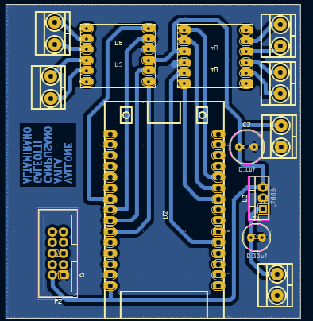

# Gestor de Inventario con Inteligencia Artificial (G.I.A.I.)

La automatizacion es una parte fundamental en la produccion de objetos que usamos dia a dia. Una seccion muy importante de esta es la categorizacion y administracion de los productos automatizados, lo cual puede ser tedioso, ya que uno tiene que ***identificar, contar y anotar*** los productos entrantes.

Para resolver esta problematica, nuestro equipo creo un proyecto de prototipo capaz de identificar fotograficamente los productos, a traves del uso de inteligencia artificial. Ademas, estos productos seran mostrados en una pagina web, donde el usuario podra administrarlos.

 

## 📒 Indice

- ⚙️ Funcionamiento

- 🔗 Componentes del proyecto

- 🔌 Conexiones esquematicas y PCB's

- 📟 Codigos y software

- ⚡ Ultimos cambios

 

## ⚙️ Funcionamiento

El recorrido de nuestro proyecto inicia en la **seccion fisica**. 

En esta, tenemos una base solida impresa en PLA (ácido poliláctico) la cual es la encargada de sostener en sus correspondientes lugares todos los elementos utilizados.

La forma en que los productos se mueven es a traves de una cinta transportadora con rodillos accionada por 4 motores. Para controlar esa logica (y toda la logica principal del sector fisico) es usado un microcontrolador ESP32 Dev-Kit-V1.

Sobre esta cinta, se encuentra el pilar central de la estructura. En su parte superior estan montados un sensor de distancia ultrasonido(HC-SR04) y una camara (ESP32Cam). Como podran suponer, la funcion de estos dos componentes es la siguiente:

Cuando el producto pase por debajo del pilar central, el sensor de distancia lo detectara. El ESP32 detendra los motores, y le dejara al ESP32Cam tomar una foto del producto. Una vez realizada esta accion, los motores se encienden nuevamente, dando lugar al siguiente producto.

Nuestra foto ya tomada es ahora enviada via Wi-Fi a un servidor de procesamiento. Es en este momento que comienza la **seccion digital**.

En el servidor de procesamiento, esta instalado una Inteligencia Artificial entrenada para reconocer los productos que pasaran por la cinta. Al finalizar esta operacion, se notifica a la parte fisica del exito, y se obtienen los siguientes datos:

- Nombre del producto
- Imagen 
- Cantidad (1)

Esta informacion es actualizada en la base de datos (MongoDB) del proyecto.

Por otro lado, existe otro servidor, el cual lee los cambios producidos en la base de datos. Este servidor es el encargado de proyectar una pagina web de administracion al usuario. El usuario podra visualizar, modificar, eliminar o agregar productos locamente al sitio web. 

Y con esto concluye el ciclo de funcionamiento de nuestro proyecto.

## 🔗 Componentes del proyecto

Los componentes fisicos principales utilizados para el desarrollo electronico de nuestro proyecto son:

- ESP32 Dev-Kit-V1
- ESP32Cam
- Sensor ultrasonido HC-SR04
- Controlador de motores DRV8833 (2)
- Motores paso a paso (4)

## 🔌 Conexiones esquematicas y PCB's

**- Placa de comando**
 
 

**- Placa ESP32Cam**
 
 

**- Controladores de motores**
 
 

**- Placa de comando**
 
 

**- Placa ESP32Cam**
 
 

## 📟 Codigos y software

A continuacion, se explica como funciona nuestra seccion de software y cuales tecnologias usamos:

- **Arduino**

Ambos microcontroladores utilizan códigos de arduino para su funcionamiento lógico, y su flujo de comunicación/acción es el siguiente:

- **Servidor AI**

Las tecnologías utilizadas para construir este servidor son YOLOv 8 (Identificación de imágenes), openCV (Procesamiento) y base64 (Convertir imágenes a URL).

Se utilizó python como lenguaje de programación.

A continuación se explica el funcionamiento del servidor:

En resumen, este servidor es el encargado de recibir las imágenes desde nuestro microcontrolador, procesarlas, analizarlas, restructurarlas y enviarlas en su correcto formato a la base de datos. 

- **Servidor pagina web**

Para la programación de la página web se utilizó el stack M.E.R.N. (Typescript como lenguaje de programación). Esta cumple con las siguientes funciones:

- Visualización de productos
- Edición de productos
- Eliminación de productos
- Búsqueda de productos
- Filtrar por etiquetas

A continuación se explican las siguientes funciones principales nombradas en el diagrama de flujo:

‘Product’ es el nombre del schema de MongoDB con el cual los productos se registran. Los productos contienen “nombre”, “precio”, “cantidad” y “ImageURL” (Imagen del producto).

‘getAllProducts’ es la función GET la cual se encarga de traer y enviar al frontend todos los productos de la base de datos. 

‘EditProduct’ es para editar productos. ‘EraseProduct’ es para borrar productos. ‘AddProduct ‘ es para añadir productos localmente desde el ordenador.’ Estas funciones se encuentran en el frontend y backend. El frontend envía la información al backend, en donde se procesa en la función correspondiente. Luego se envían a la base de datos, y se le informa al usuario el éxito o error de la operación.

## ⚡ Cambios y mejoras

Durante el transcurso de nuestro proyecto, nuestro problema principal surgio con el modelo de driver de motores. 

Originalmente nuestros controladores de motores eran modelos L298n.
El problema con esto es que, debido a la cantidad de conexiones entre componentes, nos obligaba a realizar un diseño doble faz para nuestra placa de comando. 
Hubo varios modelos de placa doble faz realizados para nuestro proyecto, pero no se acercaron a ser el modelo correcto para lo que buscabamos fabricar.
Por esto mismo, buscamos un modelo de driver de motores con diferentes conexiones mas practicas para nuestro diseño. 
Al final, los drivers L298n fueron reemplazados por drivers DRV8833. 

[Altamirano Valentino](https://github.com/val675)

[Avila Tomas](https://github.com/VMASPAD)

[Campusano Federico](https://github.com/FedeCampu1)

[Sebastian Galeotti](https://github.com/Kickdart)

[Vallone Fabrizio](https://github.com/FabrizioVal)

Links externos:

[Informe del proyecto](https://docs.google.com/document/d/1mTRYeyY_YsD2kjhfw3tEv7mwZntl2X6F49L_w81WZxs/edit?tab=t.0)

[Repositorio del proyecto](https://github.com/FabrizioVal/Proyecto_G.I.A.I.)
